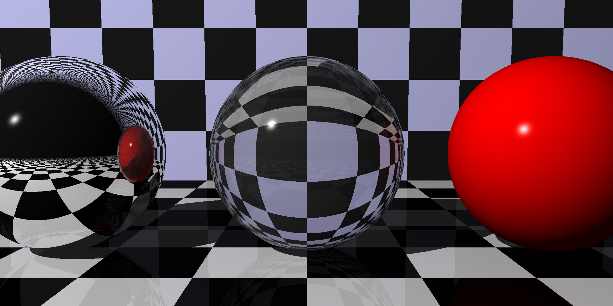
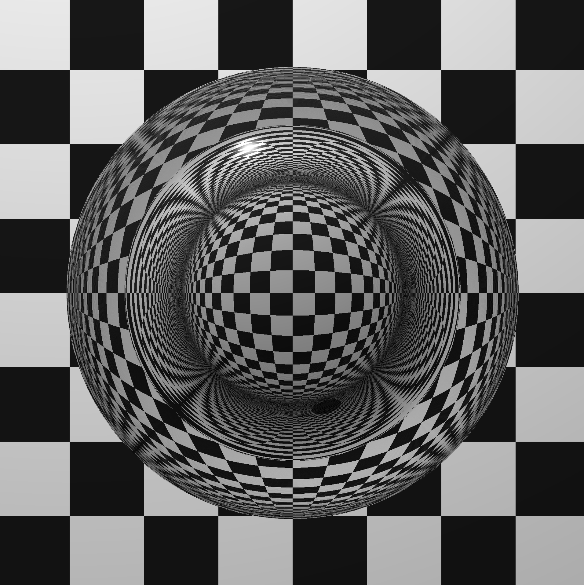

Ray Tracer (C++)

##  Features Implemented

-  Tuples and vectors
-  Polymorphic shapes (Spheres, Planes)
-  Transformations (translation, scaling, rotation)
-  Materials and lighting (Phong model)
-  Reflections
-  Refractions
-  Patterns
-  Cameras and image rendering
-  Scene composition

##  Unit Testing

Unit tests are written using **Google Test (GTest)** and cover most mathematical and rendering components.

