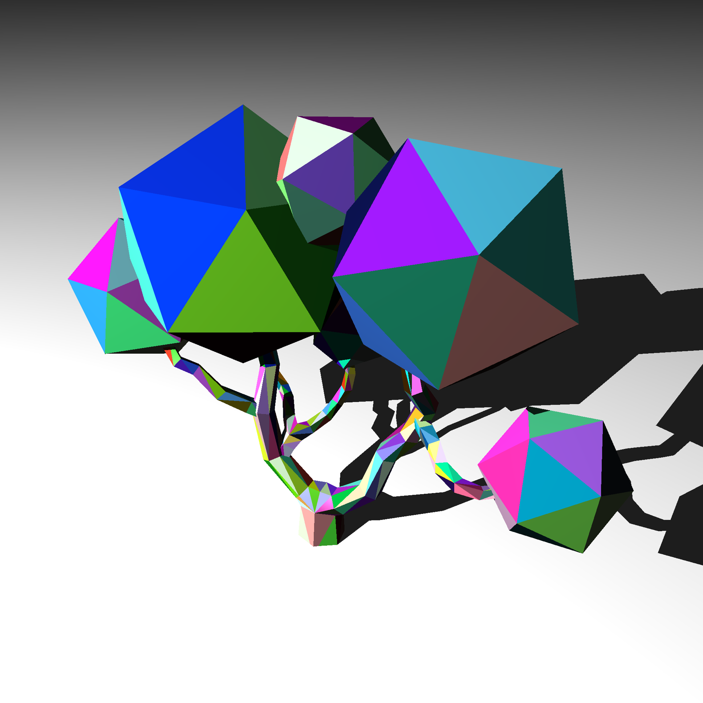

Ray Tracer (C++)

This project is a from-scratch ray tracing renderer written in C++ based on The Ray Tracer Challenge. 
My goal was to explore the fundamentals of computer graphics by writing a simple raytracer capable of rendering multiple light sources and 3D geometry from obj files.

##  Features Implemented

- Tuples (Vectors, Points, Colors)
- Polymorphic shapes (Spheres, Planes, Cube, Cylinder, Cone, Triangle)
- Groups of shapes
- Transformations (translation, rotation, scaling)
- Materials and lighting (Phong model)
- Reflections
- Refractions
- Patterns
- Cameras and image rendering
- Scene composition
- Tone mapping for multiple lights
- Obj file loading
- Unit tests are written using **Google Test** and cover most mathematical and rendering components.

